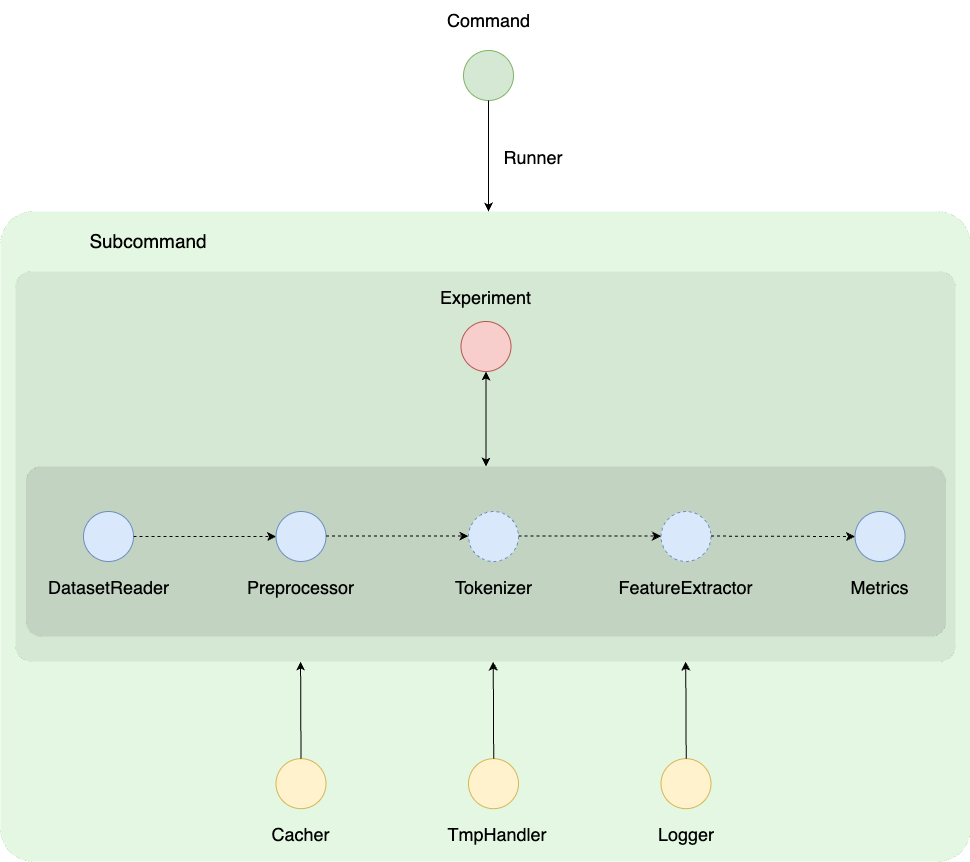

# tmynnlp
A unified system for NLP problems, using ML/DL models.




# Setup

It is recommended to use a conda environment for this project.

Follow the steps below to get started.

**Create a conda environment**

```shell
conda create -n tmynnlp_env python=3.8
```

**Install the package with the requirements**

```shell
pip install -e .
```

**To make the CLI executable from any location: set this alias in your .zshrc or .bash_profile**

```shell
alias tmynnlp='ABSOLUTE/PATH/TO/THE/DIR/tmynnlp/__main__.py'
```

# CLI usage

## Example: Running the Experiments with specific configurations:

**The runner**
```shell
tmynnlp runner runs/runs.json --include_package modules
```

**Sample runs.json file**
```json
[
    {
        "type": "exp5",
        "dataset_reader": {
            "type": "email-body",
            "train_data_path": "./data/emails/train.json",
            "val_data_path": "./data/emails/val.json"
        },
        "preprocessor": {
            "type": "default"
        },
        "tokenizer": {
            "type": "huggingface_tokenizer",
            "pretrained_model": "bert-base-cased"
        },
        "feature_extractor": {
            "type": "huggingface_model",
            "pretrained_model": "bert-base-uncased"
        },
        "ner_extractor": {
            "type": "huggingface_ner",
            "pretrained_model": "dslim/bert-base-NER",
            "ner_tokenizer": {
                "type": "huggingface_tokenizer",
                "pretrained_model": "bert-base-cased"
            }
        },
        "metrics": [
            {
                "type": "accuracy"
            },
            {
                "type": "f1",
                "average": "weighted"
            }
        ],
        "dist_metric": "cosine"
    }
]
```